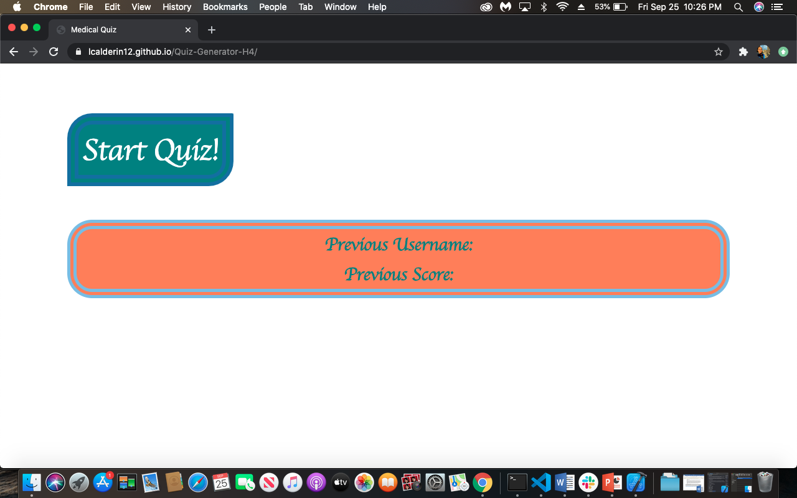
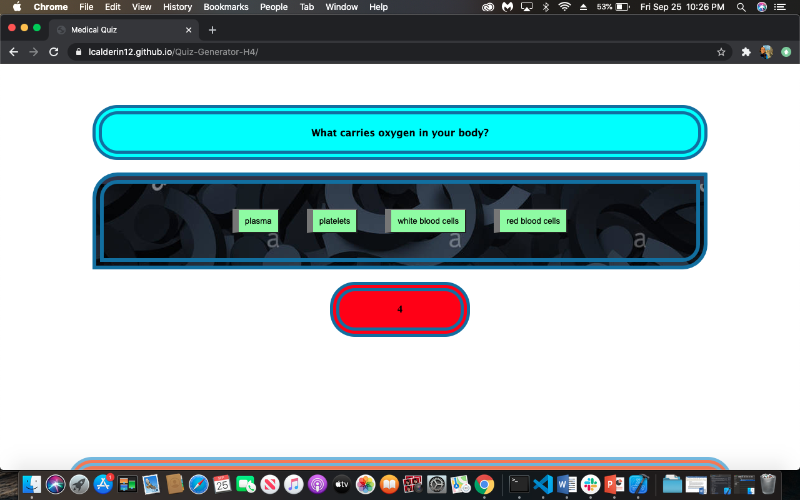
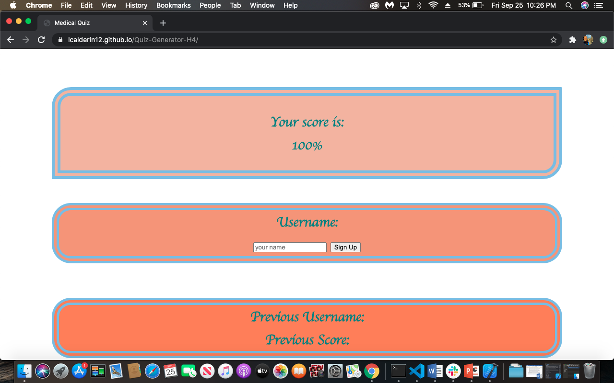

# Overview

This four question quiz will test for your knowledge of basic medical expertise. At the beginning there will be a start button. Once the start button is click the quiz will begin. There will be a 10 second period between each question. The answer must be correct before the 10 seconds ar up in order to count as a correct answer. If the time is up or the answer is wrong that question will count as wrong. At the end you will see your score. Good luck... Making this was a lot harder than the questions themselves!
 

## Links
 

[project link](https://lcalderin12.github.io/Quiz-Generator-H4/)
 
[github link](https://github.com/lcalderin12/Quiz-Generator-H4)
 

## Screenshots
 

